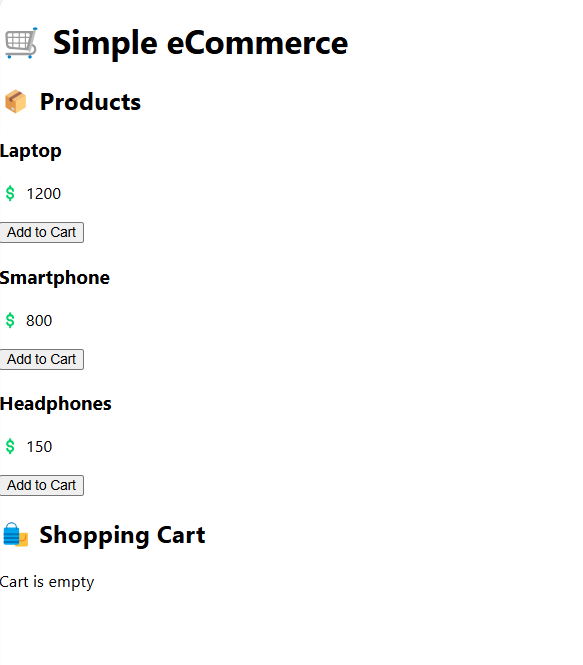

# React_E-commerce_App

Here’s a simple eCommerce website built using React, HTML, CSS, and JavaScript. This project includes:
✅ A product list
✅ An "Add to Cart" feature
✅ A cart summary

I'll create a basic React app with:

A Product List (ProductList.js)
A Shopping Cart (Cart.js)
A Main App (App.js)

📌 Steps to Run
1️⃣ Create a new React project:

bash: run below cmd
npx create-react-app@latest my-ecommerce-app
cd my-ecommerce-app
2️⃣ Replace src/App.js with the code below.
3️⃣ Add new components (ProductList.js, Cart.js).
4️⃣ Start the app:

bash: run below cmd
npm start

after npm start , http://localhost:3000/ web browser automatically opens and show this image

